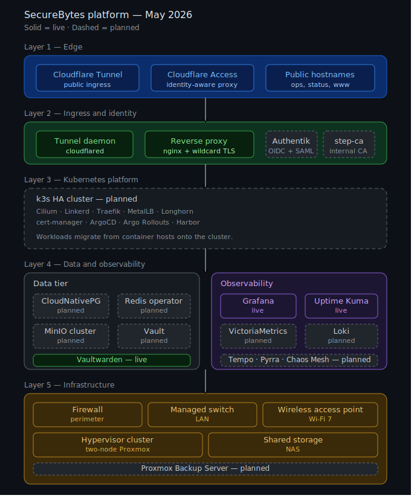

# SecureBytes Platform

A self-hosted platform operated as the internal infrastructure for a one-person company.
Every service is treated as production.

---

---

## Overview

Nine internal services behind nginx with wildcard TLS, two public services via Cloudflare Tunnel with identity-aware proxy on the admin surface, and a fourteen-monitor observability stack with push alerting. The architecture diagram above shows the five-layer structure; solid boxes are live, dashed boxes are planned.

## Current Footprint

<table>
<thead>
<tr>
<th align="left">Layer</th>
<th align="left">Live</th>
<th align="left">Planned</th>
</tr>
</thead>
<tbody>
<tr>
<td><b>Edge</b></td>
<td>Cloudflare Tunnel · Cloudflare Access</td>
<td>—</td>
</tr>
<tr>
<td><b>Ingress</b></td>
<td>cloudflared · nginx + wildcard TLS</td>
<td>Authentik · step-ca</td>
</tr>
<tr>
<td><b>Platform</b></td>
<td>—</td>
<td>k3s HA cluster (Cilium, Linkerd, ArgoCD)</td>
</tr>
<tr>
<td><b>Data</b></td>
<td>Vaultwarden</td>
<td>CloudNativePG · Redis · MinIO · Vault</td>
</tr>
<tr>
<td><b>Observability</b></td>
<td>Grafana · Uptime Kuma</td>
<td>VictoriaMetrics · Loki · Tempo · Pyrra</td>
</tr>
<tr>
<td><b>Infrastructure</b></td>
<td>Two-node Proxmox · NAS · pfSense</td>
<td>Proxmox Backup Server</td>
</tr>
</tbody>
</table>

## Live Status

The platform's public status page is monitored continuously and exposes uptime for every component above the infrastructure layer.

[**status.securebytes.net/status/lab →**](https://status.securebytes.net/status/lab)

